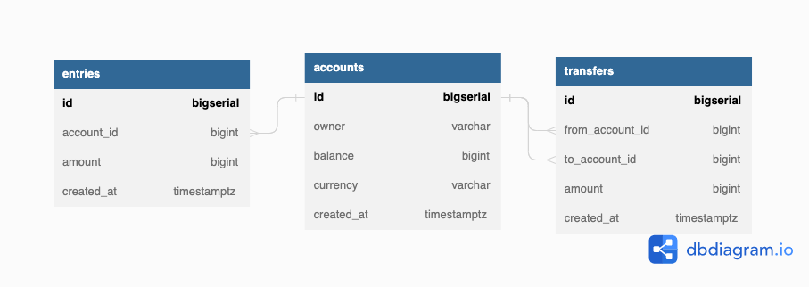

# README

- [README](#readme)
  - [Prerequisites](#prerequisites)
  - [Tools](#tools)
  - [Targets in the Makefile](#targets-in-the-makefile)
    - [postgres](#postgres)
    - [createdb](#createdb)
    - [dropdb](#dropdb)
  - [Usage](#usage)
  - [Note on Makefile](#note-on-makefile)
  - [Go type generation](#go-type-generation)
  - [Structure](#structure)

This Makefile provides scripts for running and managing a PostgreSQL database using Docker.

## Prerequisites

- Docker must be installed on your system. Please follow the instructions on the Docker website to install it.

## Tools

In addition to the Makefile, the following tools can be used to manage and visualize your PostgreSQL database:

- [dbdiagram.io](https://dbdiagram.io/): A visual database design tool that allows you to create and modify ER diagrams for your database. It supports multiple databases including PostgreSQL.

- [TablePlus](https://tableplus.com/): A modern, native, and friendly GUI tool for relational databases. It supports PostgreSQL and provides features such as a SQL editor, data viewer, and an intuitive UI for managing your database.

- [go-migrate](https://github.com/golang-migrate/migrate): A database migration tool written in Go. It supports multiple databases including PostgreSQL.

- [sqlc](sqlc.dev): A tool for generating type-safe Go from SQL. It supports PostgreSQL and provides features such as a SQL editor, data viewer, and an intuitive UI for managing your database.

## Targets in the Makefile

The following targets are defined in the Makefile:

### postgres

This target runs a PostgreSQL container named `postgres15-1` with the following options:

- Port mapping `5432:5432`
- Environment variable `POSTGRES_USER` set to `root`
- Environment variable `POSTGRES_PASSWORD` set to `secret`
- Using the image `postgres:15.1-alpine`

### createdb

This target creates a database named `simple_bank` in the `postgres15-1` container, using the `root` user and ownership.

### dropdb

This target drops the `simple_bank` database from the `postgres15-1` container.

## Usage

To run any of the targets in the Makefile, use the following command in the terminal:

```sh
make <target>
```

## Note on Makefile

Please make sure Docker is running before executing the make targets.

## Go type generation

The `sqlc` tool can be used to generate Go types from SQL queries. The `sqlc` tool is installed in the `tools` directory. To generate the Go types, run the following command:

```sh
make sqlc
```

## Structure


